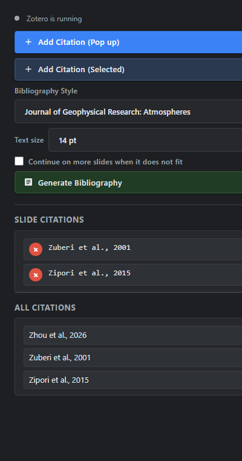
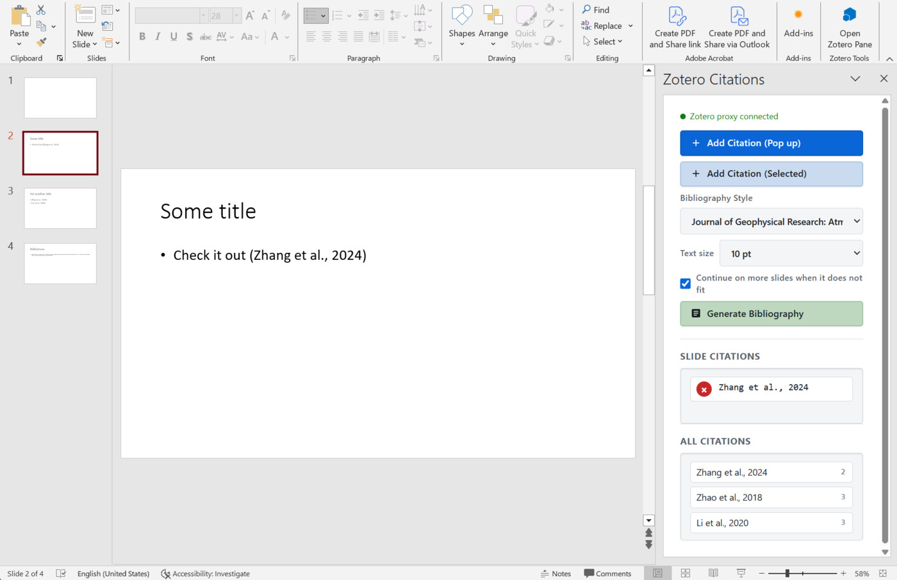

# PowerPoint Zotero Integration

Cite Zotero items in PowerPoint: pick a reference from Zotero, drop it on a slide, and build the
bibliography at the end. Everything runs on your own machine — Zotero, a small local helper, and a
PowerPoint task pane. Nothing is uploaded anywhere.



*The task pane, shown with example content. Left-click a row under `All citations` to jump to that
slide; the red `x` removes that citation's text and its entry.*

## What you get

- **Insert citations from Zotero.** A task pane in PowerPoint with two buttons: open Zotero's picker,
  or cite whatever is selected in Zotero right now.
- **In-text citations written as plain text.** `(Zuberi et al., 2001)`, exactly as you would type it,
  so it looks like your own writing and survives copy-paste.
- **The citation keys travel with the slide.** Each slide remembers which items it cites, in slide
  metadata. Edit the citation's wording, move text around, reformat — the reference is not lost.
- **Removing a citation removes both halves.** The `x` button in the pane deletes the citation's text
  from the slide *and* its entry; deleting the citation's text yourself drops the entry as well.
- **A bibliography slide, generated and refreshed.** Pick one of five styles (JGR: Atmospheres, APA,
  Chicago Author-Date, IEEE, MLA), a text size, and generate. Real italics, bold, sub- and superscript
  come from Zotero's HTML output. Pressing it again refreshes the same slide instead of adding another.
- **Long bibliographies spread over slides.** Entries that do not fit continue on `References (cont.)`
  slides, and you can turn that off with one checkbox.
- **A list of everything cited.** `All citations` shows each item with the slides that cite it; click a
  row to jump to that slide.
- **Warning for dead keys.** If a citekey no longer exists in Zotero (renamed or deleted item), the pane
  says so instead of quietly leaving it out of the bibliography.

## Requirements

| | |
|---|---|
| Zotero | with the **Better BibTeX** plugin (this is what exposes the picker and the bibliography) |
| PowerPoint | desktop, Windows. Built and tested on Office 16.0.17932 |
| Nothing else | no Node.js, no npm, no Python — see *Install* |

Better BibTeX, if you do not have it yet: download the `.xpi` from its release page, then in Zotero use
`Tools > Add-ons > ⚙ > Install Add-on From File…` and restart Zotero.

## Install

Keep Zotero running, open Windows PowerShell in this repository and run:

```powershell
powershell -ExecutionPolicy Bypass -File .\install.ps1
```

From WSL the same command works (Windows PowerShell can read the repository over `\\wsl.localhost`):

```bash
powershell.exe -NoProfile -ExecutionPolicy Bypass -File '\\wsl.localhost\<distro>\<path>\install.ps1'
```

The installer:

1. compiles the helper (`zotero-addon/helper/ZoteroHelper.cs`) using the C# compiler that ships with
   Windows, and copies it with the web files and the manifest into `%LOCALAPPDATA%\ZoteroCitations`;
2. creates a trusted certificate for `https://localhost:23000` (re-used while it is valid — PowerPoint
   task panes must be served over HTTPS);
3. registers the add-in with PowerPoint
   (`HKCU:\Software\Microsoft\Office\16.0\Wef\Developer`);
4. starts the helper now, and again at every logon through a hidden launcher;
5. checks that the pane answers, so a broken install is visible immediately.

Re-run it any time to update the installed copy. Add `-NoAutostart` if you prefer to start the helper
yourself: `%LOCALAPPDATA%\ZoteroCitations\run-server.cmd` (keeps a console open, handy for reading the
log).

**Uninstall** (removes the add-in, the certificate registration, the helper and the shortcuts):

```powershell
powershell -ExecutionPolicy Bypass -File .\uninstall.ps1
```

## Using it



*The real thing: the `Zotero Tools` group at the right end of the Home tab, the pane, and a citation on
the slide. `All citations` lists every reference in the deck with the slide it appears on — click a row
to jump there.*

1. **Restart PowerPoint** once after installing — Office reads add-in registrations at start-up.
2. Open it from `Home > Add-ins (加载项) > Zotero Citations`. The `Zotero Tools` group appears on the
   Home tab while the add-in is loaded. (Office does not pin sideloaded add-ins permanently — that is
   an Office limitation, not a setting you are missing; see *Technical details*.)
3. Select a slide and add citations:
   - `Add Citation (Pop up)` — opens Zotero's picker. Anything you fill in there (`see `, `p. 42`,
     suppress author) is written into the citation text.
   - `Add Citation (Selected)` — cites the item(s) currently selected in Zotero.
4. Choose the bibliography **style** and **text size**. Entries are laid out with that size, so a larger
   font simply means fewer entries per page.
5. `Generate Bibliography` builds or refreshes the `References` slide(s). The checkbox
   *Continue on more slides when it does not fit* (on by default) decides whether long lists spread
   over `References (cont.)` slides.
6. The lists below the buttons show the **current slide's** citations (with `x` to remove one) and
   **all citations** in the deck; click a row there to jump to that slide.

## How citations behave

This is the part worth knowing, because it explains what the pane will and will not do:

- **Editing a citation never loses the reference.** The add-in remembers which text box received the
  citation, so you can rewrite `(AAA et al., 2022)` as you like — fix the author, the year, add
  `see this`, move it into a group — and the entry stays.
- **A citation is gone when its text box is gone or emptied.** That is what a deletion looks like. The
  pane then reports the keys it dropped, and the bibliography follows.
- **`x` removes the citation's text too.** It finds the text it wrote, and if that exact text was
  edited, the piece of the citation group that still matches (same year, shared words). In a group like
  `(AAA et al., 2022, see this; BBBB et al., 2000)`, removing AAA leaves `(BBBB et al., 2000)`.
- **If the text cannot be found at all** (you rewrote the citation beyond recognition), the pane says
  so and only removes the entry — check the slide afterwards.
- **Citations from an older version of this add-in** have no remembered text box. They are never
  dropped automatically; remove them with `x`.

## Troubleshooting

Log file: `%LOCALAPPDATA%\ZoteroCitations\server.log` — it records the helper's work *and* the pane's
own failures, so it is the first thing to read.

| Symptom | What to do |
|---|---|
| Pane is blank, or shows no styling | Reopen the pane (it reloads itself once for a missed stylesheet). Still blank: open `https://localhost:23000/taskpane.html` in a browser and read the log |
| `Proxy not running` / status dot red | The helper is not running: run `%LOCALAPPDATA%\ZoteroCitations\run-server.cmd`, or re-run `install.ps1` |
| `FATAL: could not bind to port …` | Another copy of the helper is already running |
| Pane stops loading after about a year | The localhost certificate expired — re-run `install.ps1` |
| Add-in is not on the Home tab | Office keeps sideloaded add-ins under `Home > Add-ins`; starting it there loads the pane and its ribbon group for that session |
| Bibliography is a single giant text box | The page split fell back to a character budget — check the log for `bibliography text height`, and tell me the numbers |
| Anything unexpected | The pane posts its errors to the log; `citation scan: …`, `citation shape check failed`, `shape …` lines say what it saw |

## Alternative: Script Lab

You can run the same logic as a Script Lab snippet instead of installing the add-in. It needs the
helper, so run `install.ps1 -NoAutostart` first (or start `ZoteroHelper.exe --no-static` yourself), then
in Script Lab create a snippet and copy `index.html`, `style.css` and `script.js` into its HTML, CSS and
Script tabs. Behaviour is identical — the snippet and the add-in share the same frontend code.

---

Everything below is for people working on this repository.

## Repository layout

| Path | What it is |
|---|---|
| `shared/frontend_core.js` | **The source of truth for the pane's behaviour** — edited by hand |
| `style.css`, `index.html` | The pane's markup and styling (used by the add-in and by Script Lab) |
| `zotero-addon/helper/ZoteroHelper.cs` | The whole helper: JSON API + HTTPS file server, compiled by `install.ps1` |
| `zotero-addon/manifest.xml` | The add-in manifest (task pane + ribbon command) |
| `zotero-addon/www/` | The deployed web root — **generated**, do not edit |
| `script.js` | Generated copy of `shared/frontend_core.js` for Script Lab — do not edit |
| `install.ps1`, `uninstall.ps1` | Install / remove the add-in on Windows |
| `tools/sync_shared.ps1` | Regenerates the copies above from `shared/frontend_core.js` |
| `tools/test-helper.ps1`, `tools/test-frontend.js`, `tools/test-behaviour.js` | The test suites |

## Working on it

After changing `shared/frontend_core.js` or `style.css`:

```powershell
powershell -ExecutionPolicy Bypass -File .\tools\sync_shared.ps1   # regenerate the copies
powershell -ExecutionPolicy Bypass -File .\install.ps1             # deploy to PowerPoint
```

### Tests

```powershell
powershell -ExecutionPolicy Bypass -File .\tools\test-helper.ps1   # 34 checks
node tools/test-frontend.js                                        # 60 checks
node tools/test-behaviour.js                                       # 22 checks
```

- **`test-helper.ps1`** compiles the helper, runs it against a stub Better BibTeX and checks the API,
  the CORS preflight, the HTTPS file server, no-cache headers, path traversal, the log endpoint and the
  snapshot endpoint.
- **`test-frontend.js`** runs the pane's code without a browser: the citation text builder, the
  HTML-to-formatting parser, the bibliography entry splitter, the citation tag formats, the span finder,
  and an **Office.js usage lint** that fails when a collection is read before its `load()` was delivered
  by an awaited `context.sync()` — a mistake that cost a debugging session once. The lint has fixtures
  that must be flagged, so a broken lint fails the suite.
- **`test-behaviour.js`** runs the pane's real functions against a small in-memory PowerPoint (slides,
  shapes, text, tags) and checks the end result of the flows that matter: insert, edit, delete, remove —
  including the two-citations-in-one-text-box cases.

Nothing in the suites touches PowerPoint itself. After a change that does, restart PowerPoint and open
the pane.

## Technical details

**Two listeners in one process.** `ZoteroHelper.exe` serves the JSON API on
`http://localhost:8000` and the pane itself on `https://localhost:23000`. Both are needed: PowerPoint
requires HTTPS for task panes, and the pane's webview cannot call Better BibTeX on
`127.0.0.1:23119` directly (cross-origin, and WebView2 blocks a public page from reaching localhost —
which is also why this cannot be hosted on a web server).

**No runtimes by design.** The helper is C# 5 compiled with the `csc.exe` that ships with Windows,
because that is the only compiler guaranteed to exist on a target machine. C# 5 means no string
interpolation, no `?.`, no `nameof`. `.NET Framework` also cannot read PEM private keys, hence the
unencrypted `localhost.pfx` used for the certificate.

**API endpoints.** `/zotero` proxies Better BibTeX's CAYW calls (10-minute ceiling, because the picker
can stay open); `/bibliography` proxies its JSON-RPC bibliography generation — `format: "html"` becomes
`contentType: html`, which is what makes real italics and sub/superscript possible; `/health` drives the
status dot; `POST /log` lets the pane write its errors into `server.log`; `POST /snapshot` stores a PNG
of a generated References slide (newest 20, in `%LOCALAPPDATA%\ZoteroCitations\snapshots`) for looking at
results afterwards.

**How a citation is identified.** Slide metadata holds, per slide, a JSON list of
`{k: citekey, l: display text, s: shape id}` in a tag named `ZOTERO_CITATION_KEYS`; the shape's `id`
points at the text box that received the text. Presence is decided from that id — the text box exists and
holds text, or it does not — so no guessing from the citation's wording is needed. Finding the *span* to
delete inside a text box still needs the text, because PowerPoint offers no way to address a range of
text: the add-in looks for the label it wrote, then for the piece of a citation group that still matches.
Two earlier attempts at a hidden marker inside the text failed on this host: PowerPoint either dropped
the marker characters or displayed the citation key.

**Feature detection.** `Office.context.requirements.isSetSupported("PowerPointApi", …)` guards the
optional calls: `Slide.moveTo` and `Slide.getImageAsBase64` need 1.8 and are skipped without them
(16.0.17932 rejects `moveTo` with a `GeneralException`), shape ids need 1.3, jumping to a slide needs
1.5. The pane reports the supported sets and the host version to the log.

**Bibliography slides.** Generated slides are tagged `ZOTERO_BIBLIOGRAPHY` with their page number, so
generating again rewrites them instead of adding more; a slide already titled `References` is adopted;
surplus continuation slides are deleted. The layout comes from a blank slide's layout, and the split
uses PowerPoint's own measurement with a character-budget fallback when the host does not report usable
heights.

**Why it is not in the Office Store.** A published add-in must be served from a public HTTPS URL, and
that page cannot reach a local helper (WebView2's local-network restrictions). Certification would also
fail, since a reviewer has no local Zotero. The Microsoft 365 admin-centre route needs a Microsoft 365
Business/Enterprise licence with an organisational sign-in, which this machine does not have. So the
add-in stays sideloaded, and its ribbon group is loaded from `Home > Add-ins`.

## Links

- Better BibTeX CAYW (the picker): https://retorque.re/zotero-better-bibtex/citing/cayw
- Better BibTeX JSON-RPC: https://retorque.re/zotero-better-bibtex/exporting/json-rpc/index.html
- PowerPoint JavaScript API: https://learn.microsoft.com/en-us/javascript/api/powerpoint
